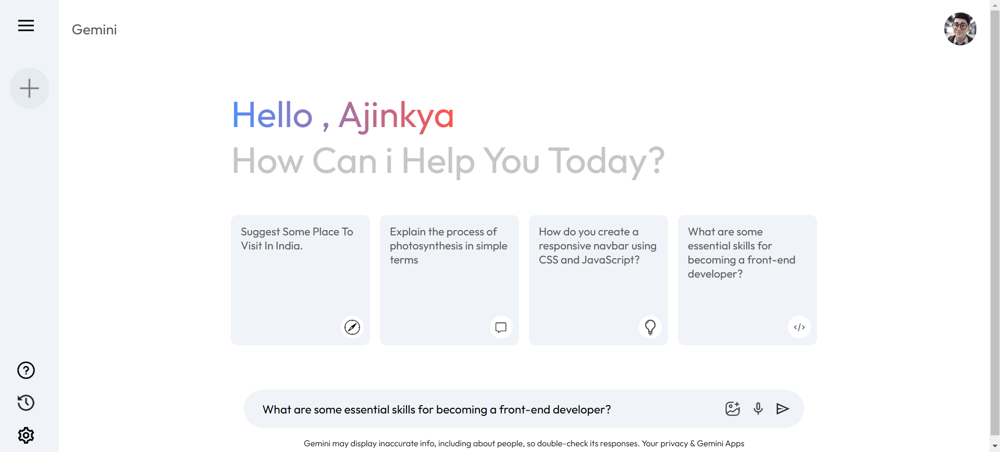
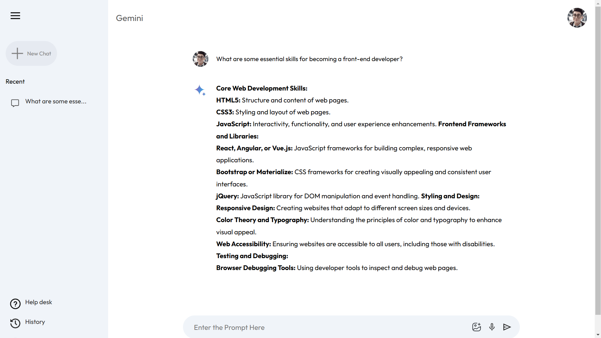

# Gemini Clone

Welcome to **Gemini Clone**, a web application designed to replicate and extend the functionality of Gemini. This project leverages modern web development practices and APIs to deliver a seamless user experience.

## Table of Contents
- [Overview](#overview)
- [Features](#features)
- [Getting Started](#getting-started)
  - [Prerequisites](#prerequisites)
  - [Setup](#setup)
- [Screenshots](#screenshots)
- [Usage](#usage)
- [Contributing](#contributing)
- [License](#license)
- [Contact](#contact)

## Overview
The Gemini Clone project is a fully functional clone of the Gemini platform, created as a learning and exploration tool. It demonstrates how to use Google's APIs and modern web technologies to build feature-rich applications.

## Features
- Interactive UI/UX.
- API integration for dynamic functionality.
- Clean and modular code structure.

## Getting Started
Follow these instructions to set up and run the project locally.

### Prerequisites
- [Node.js](https://nodejs.org/) (v16 or later recommended)
- [Git](https://git-scm.com/)
- A Google API key (refer to the [Usage](#usage) section for details)

### Setup
1. Clone the repository:
   ```bash
   git clone https://github.com/AjinkyaD3/Gemini-Clone.git
   ```
2. Navigate to the project directory:
   ```bash
   cd Gemini-Clone
   ```
3. Install dependencies:
   ```bash
   npm install
   ```
4. Add your Google API key:
   - Open `src/config/Gemini.js`.
   - Replace the placeholder with your API key.
   ```javascript
   const API_KEY = 'YOUR_GOOGLE_API_KEY';
   ```
5. Run the development server:
   ```bash
   npm start
   ```

## Screenshots
Below are some screenshots showcasing the application:

### Home Page


### Features Section


These screenshots highlight the intuitive design and functionality of the Gemini Clone project.

## Usage
1. Obtain a Google API key by following these steps:
   - Go to the [Google Cloud Console](https://console.cloud.google.com/).
   - Create a new project or select an existing one.
   - Enable the required APIs for the project.
   - Generate an API key from the **Credentials** section.
2. Add the API key to `src/config/Gemini.js`.
3. Run the project locally or deploy it to a hosting service of your choice.

## Contributing
Contributions are welcome! To contribute:
1. Fork the repository.
2. Create a new branch:
   ```bash
   git checkout -b feature-branch
   ```
3. Commit your changes:
   ```bash
   git commit -m "Add new feature"
   ```
4. Push to the branch:
   ```bash
   git push origin feature-branch
   ```
5. Create a pull request.

## License
This project is licensed under the MIT License. See the LICENSE file for details.

## Contact
**Ajinkya Dhotre**  
[GitHub Profile](https://github.com/AjinkyaD3)
